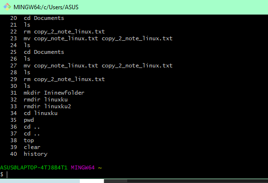
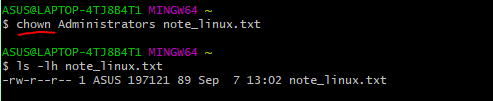
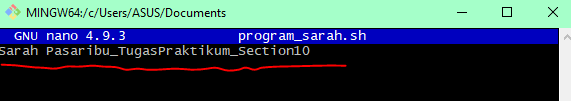
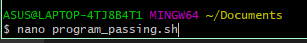

# qe_sarah-oktavia-br-pasaribu

Pengerjaan resume Section 10 program Kampus Merdeka di Alterra Academy

linux Basic Command

## Linux Basic Commands

## 1. Basic Commands

1. Implementasi Basic commands

   

cal = fungsi menampilkan kalender
date = menampilkan tanggal dan waktu yang tertera di OS kita.

NB : call tidak telihat hasilnya karena harus mendownload sudo apt install x11-apps

## 2. File System Commands

1. Implementasi basic commands

   

touch = membuat file baru yang kosong melalui baris perintah linux
maka, touch note_linux.txt = membuat file baru yang beformat txt yang bernama note_linux

2. Melihat bukti dari pembuatan note_linux.txt

3. Membuat daftar konten atau isi file pada standard output.

   

4. Menyalin file dari directory saat ini ke directory yang berbeda

   

5. Memindahkan file meskipun sebenarnya bisa digunakan untuk mengganti / mengubah nama file

   

Maka kita akan cek pada folder documents

Mengganti nama file

6. Menghapus directory/file beserta isinya

   

7. Membuat directory baru

   

8. Menghapus directory yang kosong --> tidak berhasil karna ada file didalam
   

   Menghapus directory yang kosong
   

9. Menjelajahi file dan directory linux. Melihat path yang ingin di tracking
   

10. Mencari path dari directory yang kita gunakan saat ini
    

## 3. Processes Control Commands

1. Top berguna untuk menampilkan daftar proses yang berlangsung dan seberapa banyak ruang CPU yang digunakan tiap proses
   

2. Clear berguna untuk membersihkan terminal jika didalamnya sudah terdapat banyak sekali command

   Tampilan sebelum dihapus /clear
   

   Tampilan setelah dilakukan clear

   

3. History berguna untuk mengecek kembali command yang sudah ditambahkan sebelunya atau riwayat pembukaan di gitbash
   

## 4. Utilities Programs Commands

1. ls yaitu menampilkan semua file yang ada di directory kerja kita saat ini
   

2. Which berguna untuk mencari file yang akan dieksekusi tergantung dengan command yang diberikan atau dengan kata lain perintah yang digunakan untuk menemukan path secara lengkap dari file yang dicari.
   

3. chmod berguna untuk membaca , menulis, dan manjalankan permission dari file dan directory dengan kata lain mengganti izin akses terhadap suatu file atau directory.

   

4. chwon berguna untuk mengubah/ mentransfer kepemilikan file ke user yang spesifik. Karena kita tahu bahwa semua file dimiliki oleh user khusus.  
   

## SHELL SCRIPT

## CODE SHELL SCRIPT 1

1. Membuat nano program dengan cara dibawah ini
   
   Maka akan muncul nano program yang telah kita buat
   

2. Lalu isi file "program_sarah.sh" seperti dibawah ini , yang menggunakan perintah "echo"
   

3. Kemudian run file program_sarah.sh, dan menampilkan hasil nano program yang telah dibuat sebelumnya
   

## CODE SHELL SCRIPT 2

1. Membuat nano program dengan cara dibawah ini

   

   Maka akan muncul nano program yang telah kita buat

   

2. Isilah file "program_sarah.sh" dengan seperti yang dibawah ini
   

3. Kemudian lakukan run file program_sarah.sh dengan command “cat” dan membandingkan dengan perintah file bash menggunakan ”.”
   

Keterangan :

- Perintah menjalankan file bash dengan (.) , maka isi file tidak akan dikenali karena bukan perintah linux
- Perintah “cat”, maka isi file akan terbaca karena terdapat perintah yang dikenali oleh linux yaitu perintah echo.

## CODE SHELL SCRIPT 3 penggunaan command “nano” + “echo +“read” + parameter dollar ($))

1. Buat text editor code program bernama “program_read.sh” dengan perintah “nano”
   

Maka akan muncul gambar seperti dibawah ini

2. Isilah file “program_read.sh” dengan perintah “echo” + “read”
   

3. Lakukan run file program_read.sh dengan perintah "."
   

## CODE SHELL SCRIPT 4 dengan commad “nano” + “echo” + parameter dollar ($))

1. Membuat text editor code program bernama “program_passing.sh” dengan perintah “nano”
   

2. Membuat isi file "program_passing.sh" dengan perintah tanda # + "echo"
   

NB : Tanda dollar merupakan pemanggilan parameter

3. Melakukan run file program_passing.sh
   

NB : Menjalankan perintah file bash harus membuat isi parameternya. jika dilihat ada 3 parameter yaitu

- Sarah
- Oktavia
- 4

## CODE SHELL SCRIPT 5 dengan commad “nano” + “echo” + "let"

1. Buat text editor code program bernama “program_operasi.sh” dengan perintah “let”
   

Maka akan muncul tampilan GNU nano gitbash seperti dibawah ini

2. Buat isi file “program_operasi.sh” dengan operasi penjumlahan dengan perintah “let”
   

Gambar diatas menunjukkan bahwa akan melakukan operasi penjumlahan dengan nano program.

3. Lalu lakukan run pada program_operasi.sh
   
