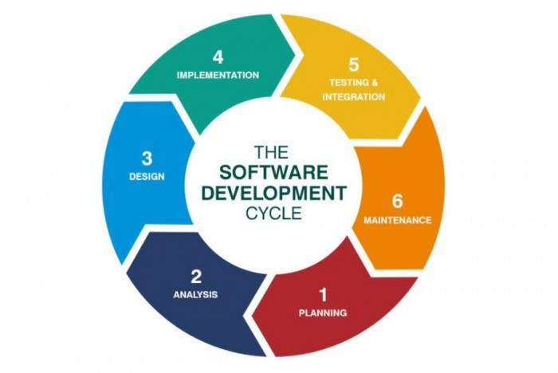

# qe_sarah-oktavia-br-pasaribu

Pengerjaan resume Section 9 program Kampus Merdeka di Alterra Academy

Agile Testing

## Agile Testing

Nama : Sarah Oktavia br Pasaribu
Kelas : QE-A

1. Pada proses SDLC (Systems development life cycle)
   

   QE berperan mulai pada fase testing hingga Maintenance.
   Pada tahap SDLC, memiliki peran nya masing-masing yaitu system analyst, UI/UX, Web developer, QE.Maka QE masuk kedalam tahap Testing & Integration , Maintenance.
   Tugas seorang QE melakukan testing (pengujian) untuk mengidentikasi bug/cacat yang ada pada proyek. Agar user dapat menggunakan aplikasi dengan baik , maupun semua proses bisnis yang terdapat didalamnya sehingga dibutuhkan effort untuk pengujian agar user menerima aplikasi tersebut dengan meminimalisir bug yang mungkin saja ditemui oleh user. Maintenance dilakukan oleh developer , namun QE melakukan pengawasan terhadap pembangunan aplikasi agar tidak ada terjadinya bug lagi sebelum aplikasi dilakukan perilisan. 2. Tantangan apa ketika menerapkan agile testing?
   Agile testing yaitu pengujian yang common digunakan oleh beberapa perusahaan. Metode ini memerlukan proses pengerjaan yang iterativ atau berulang yang dimana kesepakatan dalam hal perubahan yang terjadi adalah kesepakatan secara tim/bersama
   Maka tantangan dalam proses pengembangan perangkat lunak dengan metode agile testing adalah “Memiliki Tim yang gesit dan kerjasama tim yang baik", Semua orang menguji: Dalam proyek konvensional hanya penguji yang menguji, dalam tim tangkas semua orang menguji aplikasi, termasuk pengembang. Dalam agile, pengujian berkelanjutan dan berkelanjutan adalah satu-satunya cara untuk memastikan kemajuan berkelanjutan.

Terdapat lima point dalam testing manifesto, antara lain:

1. Testing throughout over testing at the end. Dalam menguji sebuah fitur,biasanya testing akan dilakukan secara keseluruhan di akhir proses development,sehingga sering membuat tester kewalahan dengan mengerjakan test case yang belum selesai dia kerjakan. Oleh karena itu,pada manifesto ini testing akan dilakukan bersamaaan dengan proses development, sehingga dapat dilakukan secara berkala dan lebih cepat pengerjaannya dibandingkan pengerjaan secara keseluruhan.
2. Preventing bugs over finding bugs. Cara untuk mencegah bug terjadi adalah ketika kita ingin membangun sebuah fitur maka kita harus mengurangi kemunculan bug dengan menuliskan requirement specification dari fitur yang akan kita bangun,sehingga kita dapat mempertimbangkan code-code untuk pembangunan fitur tersebut.
3. Testing understanding over checking functionality. Dengan memahami testing semua fungsionalitas yang terdapat pada sistem seorang tester juga harus memberikan masukan/ improvement terhadap fitur fitur yang di test. Karena seorang tester bukan hanya untuk melakukan pengecekan fungsionalnya , namun juga harus paham kebutuhan user untuk meningkatkan kualitas produk tersebut
4. Building the system OVER breaking the system. Ketika tester menguji sebuah sistem, hal yang paling utama harus ada adalah sebuah bug. Namun dengan adanya bug ini, tester diharapkan profesional terhadap pekerjaannya dimana tujuan utama dari pekerjaannya adalah membangun sebuah produk yang baik dan tepat guna bagi user, bukan menjadi acuan tester untuk menyudutkan developer dengan bug yang ditemukan.
5. Team responsibility for quality OVER tester responsibility. Semua tanggung jawab mengenai product yang telah dibangun adalah tanggung jawab bersama ,bukan hanya di satu orang saja. Apabila terdapat kesalahan/bug yang muncul ketika produk dirilis,bukan semata-mata hanya kesalahan tester/QA maupun developer.
